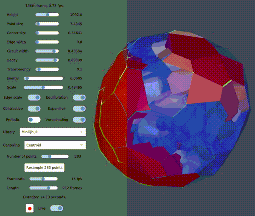
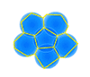
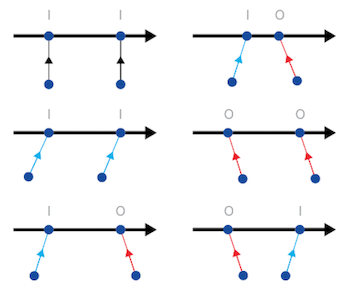

# Voro-X

This Julia packages implement the 2D and 3D simulation and visualization of the system concept introduced to me by Michel van de Gaer.



The mechanics is based on the idea that currents run along the edges and affects the size of the cells, heating them up or cooling them down, depending on their current.

The currents themselves are regulated by the sharpness of the angles at the junctions, and act like a switch/gates.



Changing cell-sizes changes the angles ...



An earlier implementation of the same concept restricted to 2D was developed in [DynamicFoam](https://github.com/weigert/DynamicFoam).
The system dynamic is detailed in [here](https://github.com/weigert/DynamicFoam/wiki/System-Dynamics).

## Settings

Comparing to [DynamicFoam](https://github.com/weigert/DynamicFoam):
* The criticality used is equivalent to an infinite criticality and cannot be changed.
* If "Edge scale" is on, the dynamics is equivalent to [DynamicFoam](https://github.com/weigert/DynamicFoam): it scales the edges. If it is off, it scales delaunay simplices.
* The "Height" setting changes the height of the rendering frame but does not influence the dynamics. The points are are samples in a fixed square or cube that cannot be changed.
* The "Periodic" setting determines whether the meshes is considered infinitely periodic along each directions.
* The "Voro shading" determines whether the Voronoi cells are displayed (if it is on) or the Delaynay cells (if it is off). The transparency of the shading is determined by the "Transparency" setting.

## Reporting issues

As the software use randomness. Running it twice give different results.
To make things reproducible, you can fix the seed as follows where 1234 can be replaced by any number:
```julia
julia> using VoroX

julia> using Random

julia> Random.seed!(1234)

julia> foam(K, N)
```
If the program is run again with the same seed (1234 here), it will produce exactly the same simulations.

The issue can be reported by [opening an issue](https://github.com/blegat/VoroX.jl/issues/new/choose).

## Installation

Download this repository. Let `path/to/VoroX` be the directory where this package was decompressed.

[Install Julia](https://julialang.org/downloads/) and launch it. You should see the following prompt:
```julia
julia>
```
Type `]` so that the prompts becomes
```julia
(@v1.6) pkg>
```
Typing backspace allows to go back to the prompt
```julia
julia>
```
Activate the environment of VoroX.jl as follows:
```julia
(@v1.6) pkg> activate path/to/VoroX
```
Now install its dependencies as follows:
```julia
(@v1.6) pkg> instantiate
```
The installation should take a while.
Once this is done, to launch the software with `K` points and `N` dimensions, do
```julia
julia> using VoroX

julia> foam(K, N)
```
Note that `N` can only be 2 or 3.
For instance, for 10 points in 3D, do:
```julia
julia> foam(10, 3)
```

### Troubleshooting

On Arch Linux, linux should be launched as follows:
```julia
$ LD_PRELOAD=/usr/lib64/libstdc++.so.6 julia
```
See [this issue](https://github.com/JuliaGL/GLFW.jl/issues/198) for more details.
